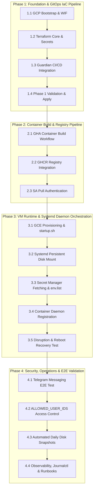

# Project Roadmap: GitOps & Terraform Infrastructure for NanoClaw with Gemini on GCP

## Executive Summary & Program Execution Decisions

This document outlines the milestone-driven roadmap for deploying and operating the **NanoGemClaw** agent infrastructure on Google Cloud Platform using declarative Terraform IaC and GitHub Actions CI/CD with `abcxyz/guardian`.

### Ratified TPM Execution Decisions

| Decision Area | Agreed Strategy | Rationale & Impact |
| :--- | :--- | :--- |
| **Q1: Phase 1 IaC vs. Container Image Dependency** | **Decoupled Phase 1 with Fallback Image** | Isolates IAM, WIF, Secret Manager, and Guardian pipeline verification from container build repo setup using a standard fallback image (`alpine:latest`) during initial apply. |
| **Q2: Secret Bootstrapping Sequence** | **Declarative GHA Secret Binding** | Populates `GEMINI_API_KEY` and `TELEGRAM_BOT_TOKEN` in GitHub Repository Secrets prior to Phase 1 apply, ensuring GCP Secret Manager versions are cleanly provisioned by Terraform. |
| **Q3: Persistence Recovery Verification** | **Disruption & Host Reboot Test** | Validates systemd `opt-nanoclaw-data.mount` and persistent disk state survival under forced VM reboot before Phase 4 E2E signoff. |

---

## Roadmap Overview & Dependency Flow

---

## Functional Phases Breakdown

### 📍 Phase 1: Foundation & GitOps IaC Pipeline
- **Milestone Goal**: Fully automated `terraform plan` and `terraform apply` pipeline executing via `abcxyz/guardian` and Workload Identity Federation (WIF).
- **Key Deliverables**:
  - GCP Service APIs, GCS state bucket, and `terraform-deployer` SA provisioned.
  - Keyless WIF Pool and OIDC Provider linked to GitHub Actions.
  - Terraform core configuration (`main.tf`, `variables.tf`, `outputs.tf`, `iam.tf`, `secret_manager.tf`).
  - GitHub Actions Guardian workflows (`terraform-plan.yml` and `terraform-apply.yml`).
  - Clean initial `terraform apply` verification using fallback container image.

### 📍 Phase 2: Container Build & Image Management Pipeline
- **Milestone Goal**: Immutable Docker container image compiled daily and on-demand, published to GitHub Container Registry (GHCR).
- **Key Deliverables**:
  - GitHub Actions workflow (`.github/workflows/build-container.yml`) for building image from `NanoGemClaw` source repository.
  - Package publication to GHCR with `latest` and commit SHA tags.
  - Registry access control verification permitting Compute Engine runtime service account image pulls.

### 📍 Phase 3: VM Runtime, Persistent Mount & Systemd Daemon Orchestration
- **Milestone Goal**: Ephemeral Compute Engine instance running containerized daemon bound to 20GB persistent disk.
- **Key Deliverables**:
  - Automated `startup.sh` script handling disk formatting, systemd mount registration (`opt-nanoclaw-data.mount`), and GCP Secret Manager fetching.
  - Production systemd container daemon (`nanoclaw-container.service`) with `Requires=opt-nanoclaw-data.mount`.
  - Disruption and reboot recovery test verifying zero data loss on SQLite database state across VM restarts.

### 📍 Phase 4: Operations, Security & End-to-End Validation
- **Milestone Goal**: Production-ready autonomous personal agent with zero-trust security and automated backup policies.
- **Key Deliverables**:
  - Messaging gateway verification (`/start` and `/status` bot command responses).
  - Security validation of `ALLOWED_USER_IDS` authorization enforcement.
  - GCP Resource Policy configuring automated daily snapshots of persistent data disk with 14-day retention.
  - Host logging (`journalctl`), system monitoring, and operational documentation.
