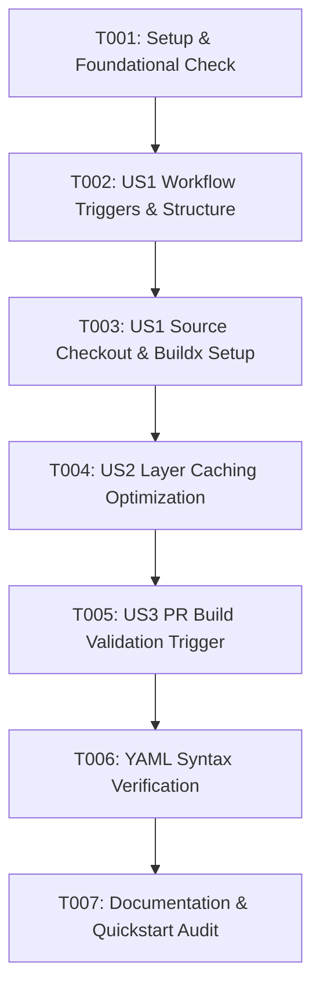

# Tasks: GitHub Actions Container Build Pipeline

**Feature Branch**: `005-gha-container-build-workflow`  
**Date**: 2026-09-04  
**Spec**: [spec.md](./spec.md) | **Plan**: [plan.md](./plan.md)

---

## Task Summary

- **Total Tasks**: 7
- **Setup & Foundation**: 1
- **User Story 1 (P1)**: 2
- **User Story 2 (P2)**: 1
- **User Story 3 (P3)**: 1
- **Polish & Verification**: 2

---

## Dependencies & Completion Order

---

## Phase 1: Setup & Foundation

- [x] T001 Audit existing workflow directory structure in `.github/workflows/`

---

## Phase 2: User Story 1 - Scheduled & On-Demand Container Compilation (Priority: P1)

Goal: Implement workflow triggers for cron daily compilation and manual dispatch.  
Independent Test: Trigger container build via `workflow_dispatch` or `gh workflow run`.

- [x] T002 [US1] Create `.github/workflows/build-container.yml` with `schedule` (`0 0 * * *`) and `workflow_dispatch` triggers
- [x] T003 [US1] Configure repo checkout step and `docker/setup-buildx-action@v3` in `.github/workflows/build-container.yml`

---

## Phase 3: User Story 2 - Docker Buildx & Cache Optimization (Priority: P2)

Goal: Optimize compilation runtime using GHA layer caching.  
Independent Test: Run consecutive build workflows and verify `type=gha` layer cache reuse logs.

- [x] T004 [US2] Configure `docker/build-push-action@v5` with `cache-from: type=gha` and `cache-to: type=gha,mode=max` in `.github/workflows/build-container.yml`

---

## Phase 4: User Story 3 - Pull Request Build Validation (Priority: P3)

Goal: Validate workflow syntax and container build stability on pull requests.  
Independent Test: Inspect PR build validation step logs on PR creation/update.

- [x] T005 [US3] Add `pull_request` trigger targeting changes to `.github/workflows/build-container.yml` in `.github/workflows/build-container.yml`

---

## Phase 5: Polish & Cross-Cutting Verification

- [x] T006 [P] Execute YAML syntax verification on `.github/workflows/build-container.yml`
- [x] T007 [P] Audit quickstart testing steps in `specs/005-gha-container-build-workflow/quickstart.md`
